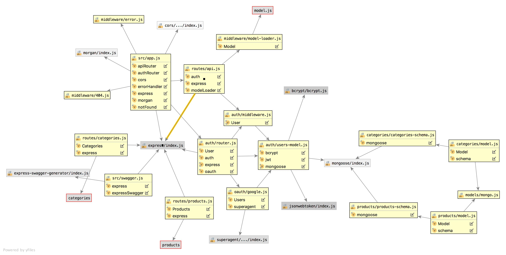

# LAB - API & Auth Server

## Lab 15

### Author: Jessica Walters

### Links and Resources
* [submission PR](https://github.com/401-advanced-javascript-jessica/401-lab-15/pulls)
* [travis](https://www.travis-ci.com/401-advanced-javascript-jessica/401-lab-15)
* [back-end](https://jessica-401-lab-15.herokuapp.com/)

#### Documentation
* [api docs](https://localhost:3333/api-docs)
* [jsdoc](https://localhost:3000/docs)

### Setup
#### `.env` requirements
* `PORT` - 3000
* `MONGODB_URI` - `mongodb://localhost:27017/lab15`

#### Running the app
* `npm start`
* Endpoint: `/api/v1/categories`
  * Returns a JSON object category data in it.
* Endpoint: `/api/v1/products`
  * Returns a JSON object with product data in it.
  
#### Tests
* `npm test`

#### UML

